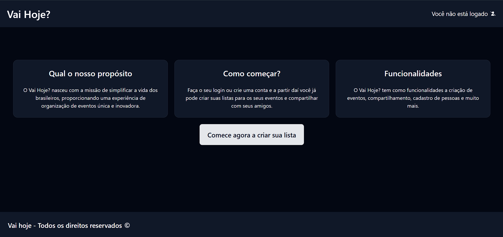
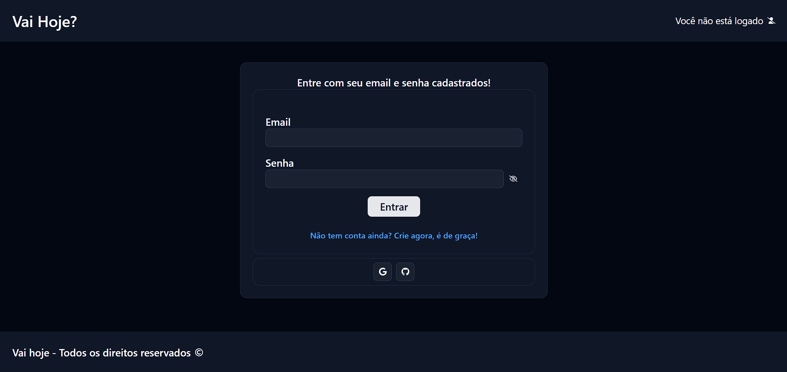
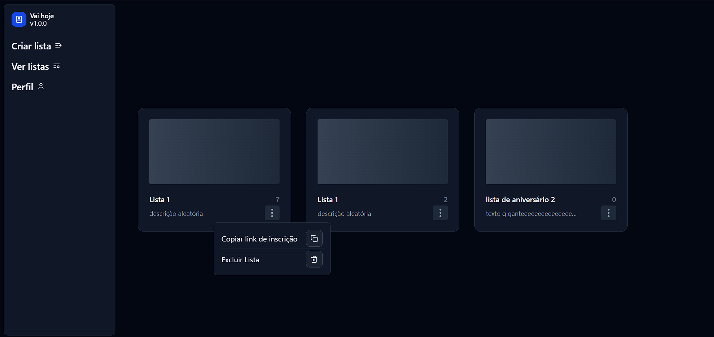
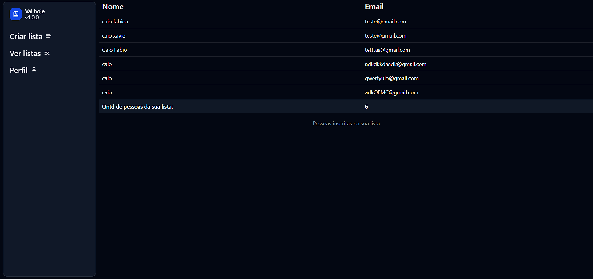

# ✅ Vai Hoje – Gerenciador de Listas

**Vai Hoje** é uma aplicação web desenvolvida com React + TypeScript para criar, compartilhar e acompanhar listas de eventos e confirmações de presença. Ela permite que usuários criem uma lista personalizada, compartilhem o link com outras pessoas e vejam as respostas em tempo real.

[🔗 Acesse o site](https://vai-hoje-gerenciador-de-listas.vercel.app/)

## 🚀 Funcionalidades

-   Criar nova lista personalizada com título e descrição
-   Compartilhar a lista via link único
-   Participantes acessam e confirmam sua presença na lista sem precisar estar cadastrados
-   Visualização em tempo real das respostas
-   Integração com banco de dados

---

## 📸 Demonstração



> _tela inicial da aplicação_



> _tela de login_



> _dashboard_



> _pessoas inscritas na lista_

---

## 🛠️ Tecnologias Utilizadas

-   [React](https://reactjs.org/)
-   [TypeScript](https://www.typescriptlang.org/)
-   [Vite](https://vitejs.dev/)
-   [Firebase](https://firebase.google.com/)
-   [Tailwind CSS](https://tailwindcss.com/)
-   [React Router](https://reactrouter.com/)
-   [Shadcn-UI](https://ui.shadcn.com/)
-   [Vercel](https://vercel.com/)

---

## 📦 Instalação Local

```bash
# Clone o repositório
git clone https://github.com/caio1213pgm/vai-hoje-GerenciadorDeListas.git

# Acesse o diretório
cd vai-hoje-GerenciadorDeListas

# Instale as dependências
npm install

# Execute o projeto localmente
npm run dev

```

---

## 🤝 Contribuindo

Contribuições são bem-vindas! Sinta-se livre para abrir issues ou pull requests com melhorias, correções ou sugestões.

## 👤 Autor

Desenvolvido por [Caio1213pgm](https://github.com/caio1213pgm)

